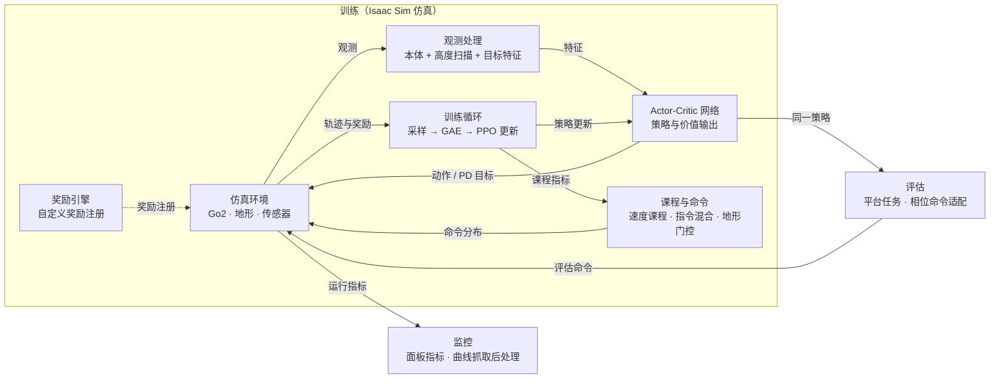

# kaiwu-semi-locomotion · Unitree Go2 四足机器人强化学习训练系统

基于 Isaac Sim / Isaac Lab 与 KaiwuDRL 的 Unitree Go2 四足机器人强化学习训练项目，支持标准地形穿越与迷宫路线导航两种任务，主线为 PPO + GAE 不对称 Actor-Critic，当前处于迷宫导航微调阶段。项目全部在仿真环境中训练与评估，暂不包含真机部署代码。

**平台：** Unitree Go2 · 16×16 高度扫描（含迷宫导航扫描） · Isaac Sim / KaiwuDRL · 12 自由度 PD 关节控制

## 项目展示

仿真环境中的地形穿越演示（坡面与楼梯）：

<table>
  <tr>
    <td align="center">
      <br/>
      <b>上缓坡</b>
    </td>
    <td align="center">
      <br/>
      <b>下缓坡</b>
    </td>
  </tr>
  <tr>
    <td align="center">
      <br/>
      <b>上台阶</b>
    </td>
    <td align="center">
      <br/>
      <b>下台阶</b>
    </td>
  </tr>
</table>

<!-- TODO：补充完整赛道视频与评估截图 -->

## 已完成功能

### 运动控制训练闭环
- [x] PPO + GAE 不对称 Actor-Critic（301 维观测 / 316 维特权观测 / 12 维动作）
- [x] 速度课程与地形课程，按跟踪效果自动推进难度
- [x] 标准地形穿越：坡面 / 楼梯混合地形与完整难度带课程

### 复杂地形与楼梯专项
- [x] 基于高度扫描的地形门控与相位命令
- [x] 楼梯专项奖励链：抬脚、落脚、步幅与过顶保护
- [x] 奖励退火重平衡与对照组验证，缓解长训后期"保守拖时"退化
- [x] 训练指令混合（command mix），避免对单一指令分布过拟合

### 迷宫路线导航
- [x] 目标特征观测与迷宫阶段感知
- [x] 按地形相位切换的速度门控（坡面 / 楼梯 / 迷宫分档限速）
- [x] 迷宫转向、贴墙与走廊居中、目标接近与完成奖励
- [x] 评估侧命令适配，训练与评估共用同一套观测与网络

### 训练工程化
- [x] 观测维度运行时断言，配置与代码不一致时快速报错
- [x] 分组监控面板：训练进展 / 速度跟踪 / 门控 / 迷宫 / 姿态能耗
- [x] 平台监控曲线抓取与后处理工具
- [x] NaN / Inf 防护，课程推进失败显式报错

### 下一步
- [ ] 动态难度压力完成奖励的长训验收与权重校准
- [ ] 分层训练支持（环境动作与训练存储动作对齐）
- [ ] 自定义迷宫导航训练阶段模板

## 系统架构



## 关键问题

### 1. 长训后期奖励预算失衡：模型"保守拖时"而非"攻克难台阶"

6 小时长训后，高难倒台阶通过能力明显退化：模型变得更稳定、更少摔倒，却学会了拖到超时。按周期聚合排除平台曲线锯齿后，归因于速度跟踪与姿态稳定等通用奖励占比过高，而"识别台阶 → 抬脚 → 落准 → 承重 → 通过"的动作链奖励占比太低。

**解决方式**
- 重新分配奖励预算，增强楼梯动作链的直接信号（抬脚、落脚、步幅、过顶保护）
- 训练指令混合（command mix），降低对单一指令分布的过拟合
- 奖励退火重平衡，并以退火前后对照组验证效果
- 新增"难度压力完成奖励"，仅按能耗与姿态评分估计的压力给予完成加成

### 2. 速度课程推进信号缺失与阈值漂移

课程以绝对奖励值为阈值时，任何奖励权重调整都会让门槛漂移；而长稳 episode 会让 episode 级指标长时间为空，课程一度停滞且监控被覆盖。

**解决方式**
- 课程度量改为 tracking ratio（跟踪奖励占理论上限的比例），与权重解耦
- 无 episode 结束时回退到 rollout 级速度跟踪误差，保证课程持续推进
- 增加最低停留时间与监控防覆盖，课程切换失败直接报错

## 使用说明

### 环境要求

Python 3 + PyTorch，需 KaiwuDRL 与 Isaac Lab（通常运行在腾讯开悟平台容器中）。

### 快速开始

```bash
python train_test.py                    # 本地快速冒烟测试
python3 -m py_compile agent_ppo/agent.py  # 语法检查（无单元测试）
```

### 训练

- 阶段切换：修改 `agent_ppo/conf/conf.py` 的 `Config.CURRENT`（当前 `TrackNavConfig` 迷宫导航，可切回 `LocomotionConfig` 标准地形），并保证对应 TOML 存在
- 配置命名：`train_env_conf_<任务类型>_<阶段名>.toml`
- 长训前先做 15–30 分钟短训验证：奖励曲线非零、`mean_episode_length` 稳定、无配置校验错误

### 仿真与评估

- 评估复用同一套观测处理与网络，评估侧按地形相位切换速度命令
- 训练监控由 `agent_ppo/conf/monitor_builder.py` 按主题分组上报
- `arena_frontend_monitor/` 提供平台监控曲线抓取与后处理脚本

### 配置说明

- 观测维度：Policy 301 维（迷宫模式 +3 维目标特征），Critic 316 维（迷宫 319 维），运行时断言
- 自定义奖励：`_reward_<名称>` 实现，TOML `[rewards.<名称>]` 启用
- 地形规则：标准模式子地形比例之和为 1.0；迷宫模式地形列表以 `open_entry_maze` 结尾

### 仓库结构

```
agent_ppo/                 主训练智能体（算法 / 配置 / 特征 / 模型 / 工作流）
agent_diy/                 备选智能体模板
conf/                      平台级配置
arena_frontend_monitor/    监控曲线抓取与后处理
legged-robot/              赛题文档（公开材料归档）
docs/                      交接指南与阶段性记录
train_test.py              本地快速测试入口
```

### 更多文档

- [docs/TRAINING_HANDOFF_GUIDE.md](docs/TRAINING_HANDOFF_GUIDE.md) — 训练逻辑、奖励与交接清单
- [docs/change_records/](docs/change_records/) — 阶段性记录
- [CHANGES.md](CHANGES.md) — 改动汇总
